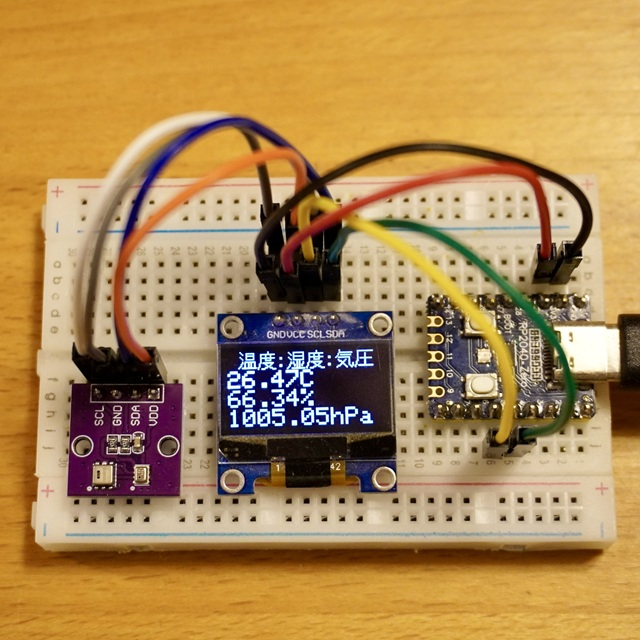
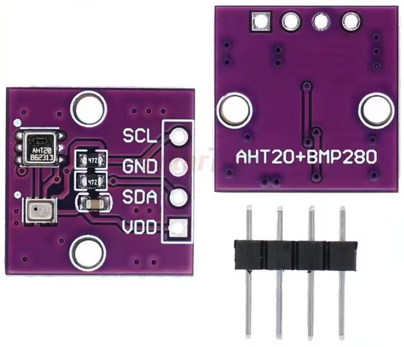
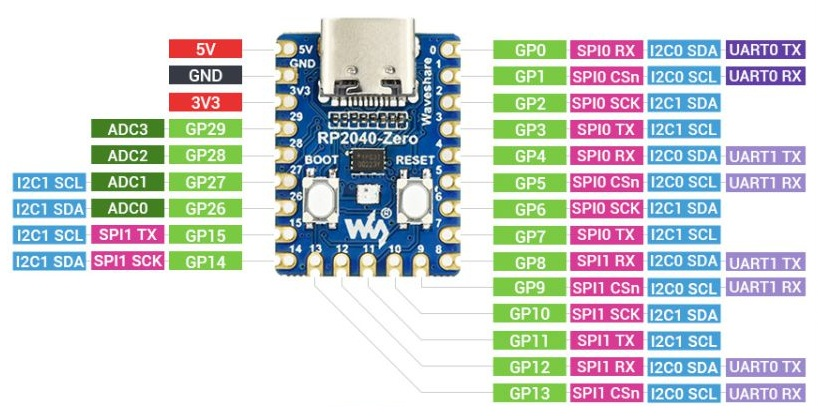
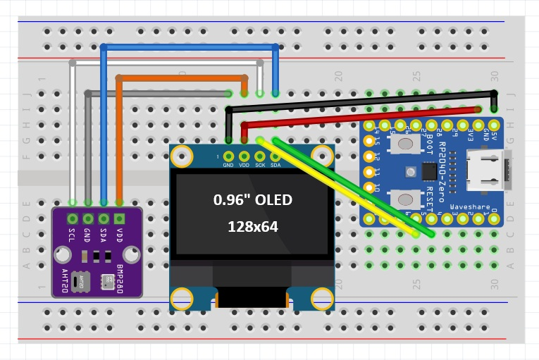
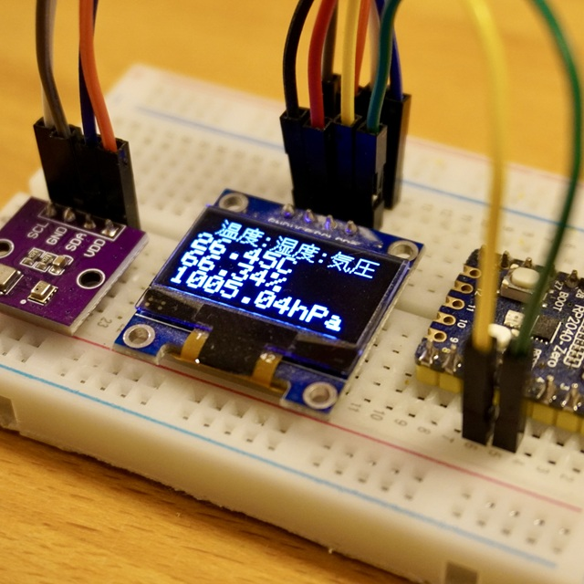

<a name="readme-top"></a>

<!-- ABOUT THE PROJECT -->

# 1. プロジェクトについて

Raspberry Pi Pico の互換ボードを使って、OLED 液晶ディスプレイの「SSD1306」へ表示するプロジェクトです。  
ASAIRの温度、湿度センサー「AHT20」と、Boschの温度、気圧センサー「BMP280」を搭載したセンサモジュールで、  
温度、湿度、気圧を同時に測定し、ディスプレイへ測定値を表示します。画面は5秒周期で更新しています。  




<p align="right">(<a href="#readme-top">back to top</a>)</p>

# 2. Arduino IDE

ボードは使用環境に合わせて選択してください。

- Arduino IDE [ツール]の指定  
  ボード：Waveshare RP2040 PiZero

- スケッチ例  
  Adafruit AHTX0 Library - adafruit_aht_test  
  Adafruit BMP280 Library - bmp280test  
  Adafruit SSD1306 Library - ssd1306_128x64_i2c

<p align="right">(<a href="#readme-top">back to top</a>)</p>

# 3. Pin配置




| PR2040-Zero | SSD1306 | ATH20+BMP280 |
| ----------- | ------- | ------------ |
| GND         | GND     | GND          |
| 5V          | VCC     | VCC          |
| GP4         | SDA     | SDA          |
| GP5         | SCL     | SCL          |

- SSD1306 : 3.3～5V
- ATH20+BMP280 : 2.0～5V

<p align="right">(<a href="#readme-top">back to top</a>)</p>

# 4. 環境構築

1. Boards Manager へ arduino-pico を追加
1. ツールのボードは"Waveshare RP2040 PiZero"を選択

Boards Manager への追加はこちらを参考にしてください。  
https://github.com/earlephilhower/arduino-pico/

<p align="right">(<a href="#readme-top">back to top</a>)</p>

# 5. ツール

OLED SSD1306に文字を表示するための、文字列データを作成する方法です。

## 5.1. 画像作成

DotGothic16 を使用して、任意の文字列の白黒PNG画像を作成します。  
DotGothic16にある「main.py」を変更して、実行してください。
```
TEXT = "温度:湿度:気圧"
```

使用するには、PILのインポートが必要です。

## 5.2. 画像変換

Adafruit SSD1306 Library の「scripts」を使用して、  
PNG画像をソースコードへ組み込める配列データに変換します。

scriptsにある「Makefile」を変更して、実行してください。
```
	${PY} make_splash.py title.png title >>$@
```

1つ目にファイル名、2つ目に配列名を指定してください。

<p align="right">(<a href="#readme-top">back to top</a>)</p>

# 6. 画像



<p align="right">(<a href="#readme-top">back to top</a>)</p>

# 7. 参考

- [Raspberry Pi Pico を Arduino IDE から使う方法](https://garchiving.com/use-raspberry-pi-pico-with-arduino-ide/)
- [arduino-pico](https://github.com/earlephilhower/arduino-pico/)  
  libraries の配下の中にある examples にサンプルコードがあります。

<p align="right">(<a href="#readme-top">back to top</a>)</p>
