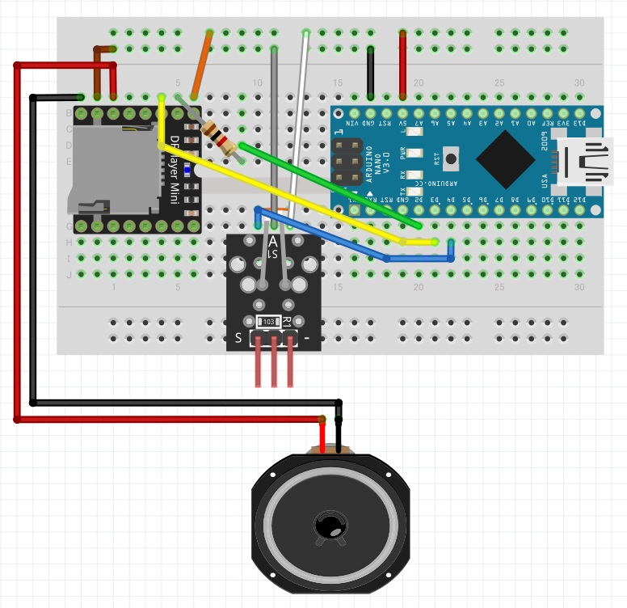
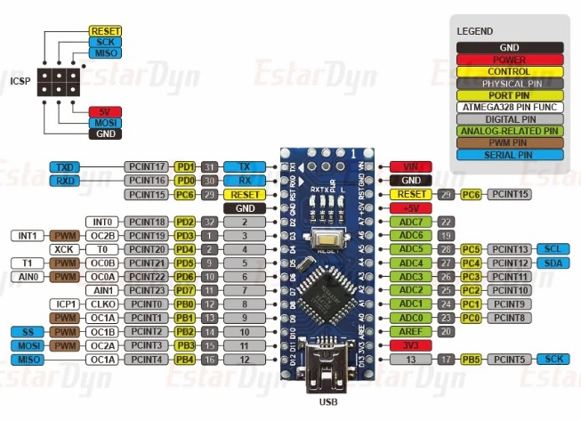
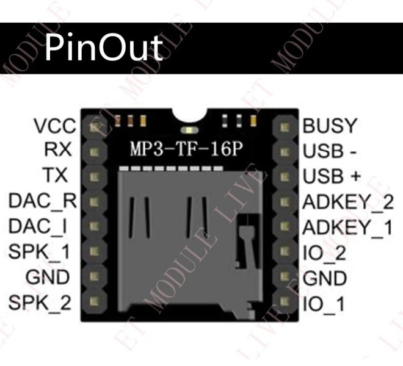

<a name="readme-top"></a>

<!-- ABOUT THE PROJECT -->

# 1. プロジェクトについて

DFPlayerMini と光センサーを使ったプロジェクトです。  
Arduino IDE を使用して、スケッチ例「01.Basics - DigitalReadSerial」を元にプログラムを作成しています。

<p align="right">(<a href="#readme-top">back to top</a>)</p>

# 2. 手順

1. Arduino IDE のインストール
2. DFPlayerMini.ino をダブルクリック
3. ボードと Processor の設定
4. Arduino Nano を配線
5. Arduino Nano と通信可能な USB ケーブルを接続
6. コンパイルと書き込み

# 3. Arduino IDE

Arduino IDE のインストールは最下段のリンク「Arduino IDE」から Arduino IDE をダウンロードして行います。  
インストール後、Arduino IDE のメニュー[ツール]からボードの設定を行い、本スケッチをコンパイル、書き込みを行います。

- Arduino IDE [ツール]の指定
  - ボード：[Arduino AVR Boards]-[Arduino Nano]
  - Processor：ATmega168

<p align="right">(<a href="#readme-top">back to top</a>)</p>

# 4. 配線図

| MP3   | Nano |     | 光センサー | Nano |
| ----- | ---- | --- | ---------- | ---- |
| VCC   | 5V   |     | VCC        | 5V   |
| RX    | D2   |     | GND        | GND  |
| TX    | D3   |     | D0         | D4   |
| SPK_1 | SPK+ |     |            |      |
| GND   | GND  |     |            |      |
| SPK_2 | SPK- |     |            |      |

※RX への配線には抵抗(1K オーム)を入れます。





<p align="right">(<a href="#readme-top">back to top</a>)</p>

# 5. DFPlayer Mini

SD カードのフォルダ名、ファイル名は次のように付けます。

```
- 01
  - 001.mp3
  - 002.mp3
  - 003.mp3
- 02
  - 001.mp3
  - 002.mp3
```

<p align="right">(<a href="#readme-top">back to top</a>)</p>

# 6. 参考

- [Arduino IDE](https://www.arduino.cc/en/software)
- [Arduino Nano](https://store-usa.arduino.cc/products/arduino-nano/)
- [小型の MP3 プレーヤーモジュール DFPLayer の使い方](https://blog.hrendoh.com/how-to-use-dfplayer-mini/)
