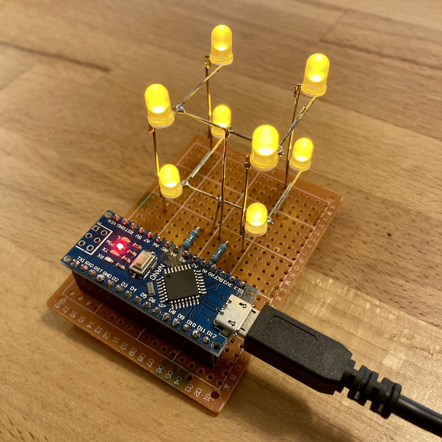
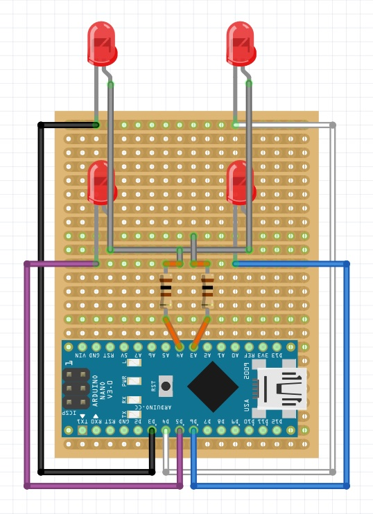
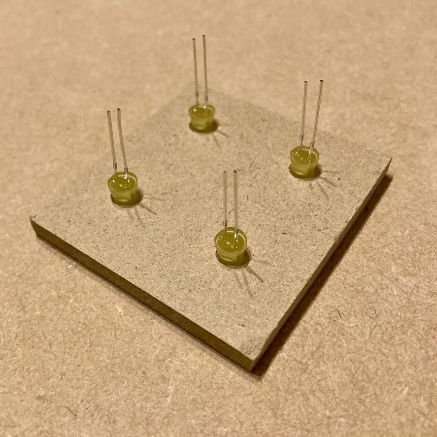
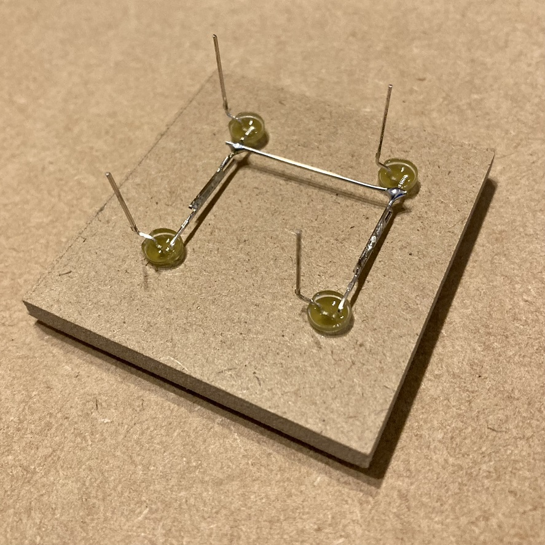
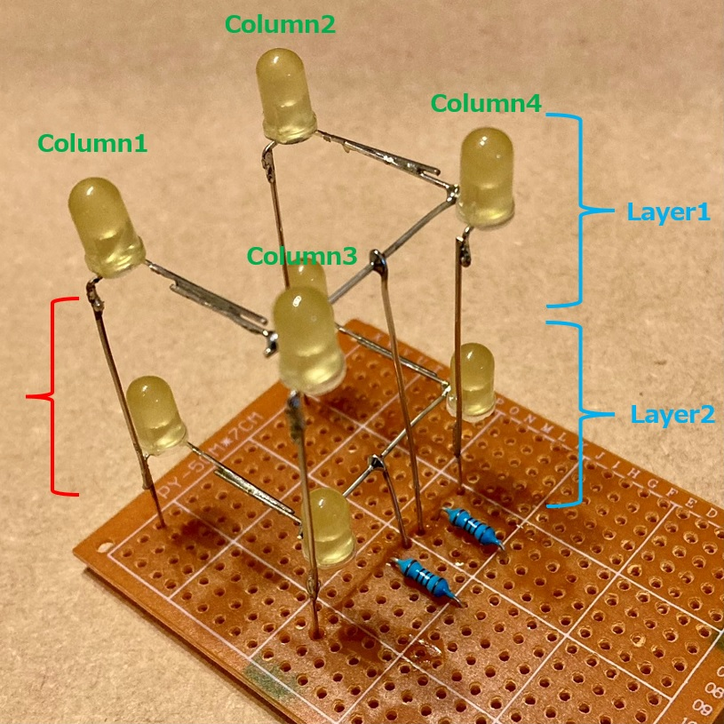

<!-- ABOUT THE PROJECT -->

# 1. プロジェクトについて

LED 8 個を使った 2x2x2 の LED Cube を作成するプロジェクトです。  
Arduino IDE を使用して、スケッチ例 01.Basics - Blink を元に、LED のプログラムを作成しています。

(<a href="#readme-top">back to top</a>)

# 2. Arduino IDE

- Arduino IDE [ツール]の指定  
  ボード：Arduino Nano  
  プロセッサ：ATmega328P (Old Bootloader)

- スケッチ例  
  01.Basics - Blink

(<a href="#readme-top">back to top</a>)

# 3. 配線図

| Nano | LED     |
| ---- | ------- |
| A3   | Layer1  |
| A4   | Layer2  |
|      |         |
| D3   | Column1 |
| D4   | Column2 |
| D5   | Column3 |
| D6   | Column4 |

(<a href="#readme-top">back to top</a>)

# 4. 作り方

## 4.1. Layer の作成

- LED Cube 作成プレート に LED のアノード(+)が右になるように 4 個挿します。

- 前の LED のアノードを後ろへ、後ろの LED は前へ倒してはんだ付けします。
- 適当な長さに切ったすずめっき線を横にはんだ付けします。
- カソード(-)を L 字型に曲げます。L 字の角は LED の外側で曲げます。
- 2 つ作ります。

## 4.2. LED Cube の作成

- 赤の部分をはんだ付けするため、すずめっき線を適当な長さに切ります。
- すずめっき線を使って、2 つの Layer のカソードをはんだ付けします。
- Layer1 の横線からユニバーサル基盤までの長さの線を作ります。
- Layer1 の横線にはんだ付けします。Layer2 も同様です。

## 4.3. ユニバーサル基盤への配線

- Nano 用のヘッダーソケットをはんだ付けします。
- 角の 4 つと、線をつなげる 6 箇所をはんだ付けすれば十分です。
- 配線図の通りにはんだ付けします。
- A3 と A4 の間には 100 オームの抵抗をいれます。

## 4.4. プログラムの書き込み

- すぐにお試ししたい場合には、LEDCube.ino を書込します。

# 5. 参考

- [Arduino IDE](https://store-usa.arduino.cc/products/arduino-nano/)
- [Arduino Nano](https://store-usa.arduino.cc/products/arduino-nano/)
