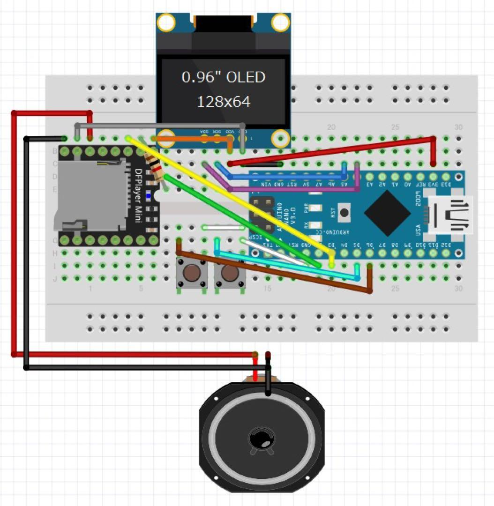

<!-- ABOUT THE PROJECT -->

# 1. プロジェクトについて

Arduino Nano で MP3 Player を作成するサンプルプログラムです。

(<a href="#readme-top">back to top</a>)

# 2. 配線図

(<a href="#readme-top">back to top</a>)

# 3. 参考

- [Arduino IDE](https://www.arduino.cc/en/software)
- [Arduino Nano](https://store-usa.arduino.cc/products/arduino-nano/)

(<a href="#readme-top">back to top</a>)

