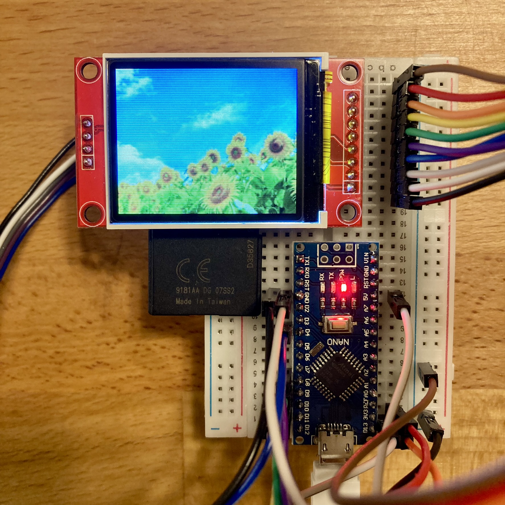

<!-- ABOUT THE PROJECT -->

# 1. プロジェクトについて

Arduino Nano で SD の画像を ST7735 へ表示するサンプルプログラムです。

(<a href="#readme-top">back to top</a>)

# 2. 配線図

| TFT  | Nano |
| ---- | ---- |
| VCC  | 5V   |
| GND  | GND  |
| CS   | D10  |
| RST  | D8   |
| A0   | D9   |
| SDA  | D11  |
| SCK  | D13  |
| LED  | 3V3  |
|      |      |
| CS   | D4   |
| MOSI | D11  |
| MOSO | D12  |
| SCK  | D13  |

(<a href="#readme-top">back to top</a>)

# 3. 参考

- [Arduino IDE](https://www.arduino.cc/en/software)
- [Arduino Nano](https://store-usa.arduino.cc/products/arduino-nano/)

(<a href="#readme-top">back to top</a>)

